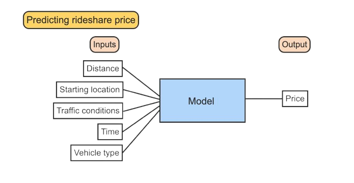
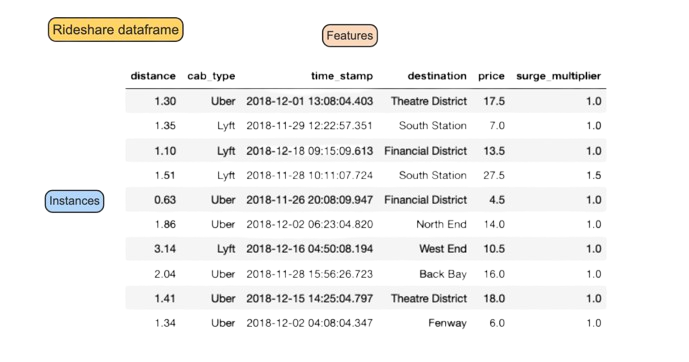
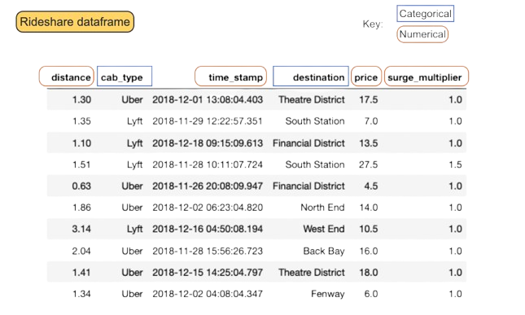
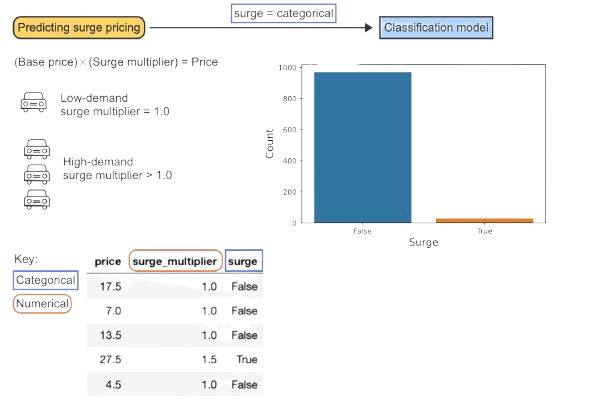
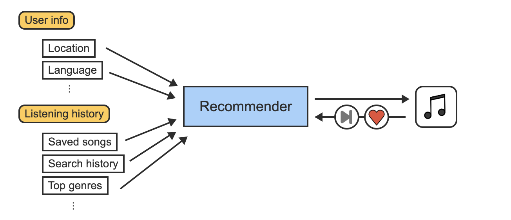

<!-- =========================================
     TITLE SLIDE (No Book Bind)
     ========================================= -->
<section>

  <!-- Main white paper w/ lines -->
  

    

    

        <h1>Pattern Recognition  and  Machine Learning</h1>
    

    

    <h4>Introduction to machine learning</h4>
    <ul>
      <li>Introduction to machine learning</li>
      <li>Feature and model types</li>
      <li>Bias-variance tradeoff</li>
      <li>Case study: Machine learning at Spotify</li>
    </ul>
    

  

  <!-- “Hello My Name Is” sticker at top-right -->
  

    

      HELLO
       
      MY NAME IS
    

    

      Jue Guo
       
      University at Buffalo, SUNY
    

  

</section>

---
<!-- _class: toc -->
<section class="toc">

# Table of Contents

- [Table of Contents](#table-of-contents)
- [Introduction to Machine learning](#introduction-to-machine-learning)
  - [Machine Learning](#machine-learning)
  - [Dataframes](#dataframes)
  - [Input and Output Features](#input-and-output-features)
- [Feature and model types](#feature-and-model-types)
- [Bias-variance tradeoff](#bias-variance-tradeoff)
  - [Bias](#bias)
  - [Variance](#variance)
  - [Error Variance vs. Prediction Variance](#error-variance-vs-prediction-variance)
  - [Underfitting vs. Overfitting](#underfitting-vs-overfitting)
  - [Bias-Variance Tradeoff](#bias-variance-tradeoff-1)
  
- [Case study: Machine learning at Spotify](#case-study-machine-learning-at-spotify)
  - [Spotify User Data](#spotify-user-data)

 <!-- end .toc-multi-col -->

</section>

---

<!-- _class: spiral-slide -->

  <!-- The pink border around the white page -->
  

    

      

      

    

    

      <!-- Circle with the number -->
      

        01
      

# Introduction to Machine learning
  

---

<section>

## Machine Learning

  <!-- Left Column -->
  

  **Machine learning** uses algorithms and models to make predictions and discover patterns in data.

  - A **model** is a mathematical function for describing the relationship between inputs and outputs and making predictions. 
  - An **algorithm** is a procedure or set of decision rules used to carry out a machine learning task, such as making a prediction.
  
  Machine learning combines tools and theory from computer science, artificial intelligence, statistics, and mathematics to make predictions and apply knowledge to new data.

  

<!-- Right Column -->
<!-- Right Column -->

  

    

    <!-- Replace with your actual path/filename -->
    
    

    
A rideshare fare can be predicted using machine learning by considering distance, location, traffic, time, and vehicle type. The model processes these inputs to produce a predicted price.

  

  

 <!-- end .column right-col -->

 <!-- end .columns -->

 <!-- end .notepad-zone -->

 <!-- end .body-container -->
</section>

---

<section>

## Dataframes

  <!-- Left Column -->
  

  A **dataset** is a collection of information containing features and instances.  
  - An **instance** is an individual data point or observational unit.  
  - A **feature** is a characteristic measured on each instance.  

  Datasets are often stored in **tabular** format, with instances as rows and features as columns.  
  A **tabular** dataset is commonly called a **dataframe**.

  

<!-- Right Column -->

  

    

    <!-- Replace with your actual path/filename -->
    
    

      

        A dataframe is a tabular structure where each row is an instance and each column is a feature. 
        This rideshare dataset includes distance, cab type, time stamp, destination, price, and surge multiplier, 
        with each row representing a single trip.
      

    

  

 <!-- end .column right-col -->

 <!-- end .columns -->

 <!-- end .notepad-zone -->

 <!-- end .body-container -->

</section>

---

<!-- Slide: Input & Output Features -->
<section>

## Input and Output Features

  <!-- Left Column -->
  

Machine learning models use **input features** to predict the value of an **output feature**:

- **Input features** (explanatory variables) are the model’s inputs.
- **Output feature** (target variable) is the value the model aims to predict.

For example, in rideshare pricing:
- The distance of a trip is an **input feature**.
- The ride price is the **output feature**.

  

  <!-- Right Column: Image & Short Caption -->
  

  

    

    <!-- Replace with your actual path/filename -->
    
    

    
    A scatter plot showing **distance** (miles) on the x-axis and **price** (USD) on the y-axis.  
    Longer distances correlate with higher prices, suggesting a linear model might be suitable.
    

  

  
 <!-- end right-col -->

 <!-- end columns -->

 <!-- end .notepad-zone -->

 <!-- end .body-container -->
</section>

---

<!-- Slide: 1.1.8 - Types of Machine Learning (Two-Column, Single Image) -->
<section>

<h2>Types of Machine Learning</h2>

<!-- Left Column: Text Content -->

  

    Three major areas of machine learning exist: 
    <strong>supervised learning</strong>, 
    <strong>unsupervised learning</strong>, 
    and <strong>reinforcement learning</strong>.
  

  <ul>
    <li><strong>Supervised learning</strong> predicts a known output feature based on input features.</li>
    <li><strong>Unsupervised learning</strong> describes patterns in a dataset without a known output feature.</li>
    <li><strong>Reinforcement learning</strong> describes algorithms that make decisions and update based on the result of the previous decision.</li>
  </ul>

 <!-- end .column left-col -->

<!-- Right Column: Single Image -->

  

    <!-- Replace with the correct path/filename -->
    
    

    

      

        The type of ML depends on the task: predicting price is supervised (output known), 
        grouping customers is unsupervised (no known output), and updating price after 
        rejection is reinforcement (feedback-based).
      

    

  

 <!-- end .column right-col -->

 <!-- end .columns -->

 <!-- end .notepad-zone -->

 <!-- end .body-container -->
</section>

---

<!-- _class: spiral-slide -->

  <!-- The pink border around the white page -->
  

    

      

      

    

    

      <!-- Circle with the number -->
      

        02
      

  # Feature and model types
  

---

<!-- Slide: 1.2.1 Categorical vs. Numerical Features (Two-Column) -->
<section>

<h2>Feature Types</h2>

<!-- LEFT COLUMN: Definitions / Text -->

  

    Features in a dataset may be 
    <strong>categorical</strong> or <strong>numerical</strong>.
  

  <ul>
    <li>
      <strong>A categorical feature</strong> has non-numerical values, or 
      numeric-like values without real mathematical meaning 
      (e.g., “yes/no,” “address,” “regular/occasional/new”).
    </li>
    <li>
      <strong>A numerical feature</strong> has meaningful numeric values 
      (e.g., amount spent on a transaction, square footage of a house).
    </li>
  </ul>

  

    Context matters. For example, phone numbers look numeric but do not support 
    math operations—so they’re considered <strong>categorical</strong>.
  

<!-- end .column left-col -->

<!-- RIGHT COLUMN: Image & Caption -->

  

  

    
    

    

      In this rideshare dataframe, distance, price, and surge_multiplier 
      are numerical; cab_type and destination are categorical.
    

    

  

<!-- end .column right-col -->

 <!-- end .columns -->

 <!-- end .notepad-zone -->

 <!-- end .body-container -->
</section>

---
<!-- Slide: Classification Models (Two-Column) -->
<section>

<h2>Classification Models</h2>

<!-- LEFT COLUMN: Explanation / Text -->

  

    <strong>Classification models</strong> are 
    <em>supervised machine learning</em> models that assign instances 
    to a predicted category (class) based on input features. 
  

  <ul>
    <li>
      Classifiers may output the class directly (e.g. “True” or “False”) 
      or a probability that the instance belongs to a specific class.
    </li>
    <li>
      In classification, input features can be numerical or categorical, 
      but the <em>output feature</em> must be <strong>categorical</strong>.
    </li>
  </ul>

  

    In rideshare pricing, we can model “<strong>surge</strong>” (whether 
    surge pricing is active) as a binary classification task: True vs. False. 
    A numerical “surge multiplier &gt; 1.0” indicates high demand (surge = True), 
    otherwise no surge (False).
  

<!-- end .column left-col -->

<!-- RIGHT COLUMN: Image + Caption -->

  

  

    <!-- Replace with your actual image path/file -->
    
    

      

        Most rides in the dataset did not have surge pricing 
        (<em>surge = False</em>). A classification model can predict 
        when <em>surge = True</em>.
      

    

  

<!-- end .column right-col -->

 <!-- end .columns -->

 <!-- end .notepad-zone -->

 <!-- end .body-container -->
</section>

---

<!-- Slide: Regression Models (Two-Column) -->
<section>

<h2>Regression Models</h2>

  <!-- LEFT COLUMN: Explanation / Text -->
  

    

      <strong>Regression models</strong> are supervised learning models 
      that predict the value of a <em>numerical</em> output feature 
      based on the input features.
    

    

      <strong>Example:</strong> Simple linear regression is a regression model 
      because the predicted values are numerical. Like classification models, 
      categorical or numerical input features may be used in regression. 
      However, the <em>output feature</em> for a regression model must always 
      be numerical.
    

  

  <!-- end .column left-col -->

  <!-- RIGHT COLUMN: Diagram + Caption -->
  

    

      

      <!-- Replace with your actual path/file -->
      
      

        

          Rideshare trips over longer distances or to popular destinations 
          are likely to have a higher price.
        

        

          Distance is a numerical input feature, and destination is categorical. 
          The output feature, price, is numerical.
        

        

          Since price is the numerical output feature, a regression model 
          should be used.
        

      

    

  

  <!-- end .column right-col -->

 <!-- end .columns -->

 <!-- end .notepad-zone -->

 <!-- end .body-container -->
</section>

---

<!-- Slide: Unsupervised Models (Two-Column, Condensed Caption) -->
<section>

<h2>Unsupervised Models</h2>

  <!-- LEFT COLUMN: Overview Text -->
  

  **Unsupervised learning models** do not make predictions about a known
  output feature. Instead, they combine features or instances while 
  searching for patterns in the data.

  <ul>
    <li><strong>Clustering models</strong> group instances with similar features.</li>
    <li><strong>Outlier detection models</strong> identify unusual instances in a dataset.</li>
    <li><strong>Dimension reduction</strong> combines related features to reduce 
        the complexity of a dataset.</li>
  </ul>
  

  <!-- end .column left-col -->

  <!-- RIGHT COLUMN: Visuals + Condensed Caption -->
  

    

      

      <!-- Replace with the path to your images or a combined illustration -->
      
      

        

          Clustering groups rideshare trips by distance and price. 
          Outlier detection flags unusual points (e.g., high fare or distance). 
          Dimension reduction uses principal components to summarize features 
          and reveal patterns.
        

      

    

  

  <!-- end .column right-col -->

 <!-- end .columns -->

 <!-- end .notepad-zone -->

 <!-- end .body-container -->
</section>

---

<!-- _class: spiral-slide -->

  <!-- The pink border around the white page -->
  

    

      

      

    

    

      <!-- Circle with the number -->
      

        03
      

# Bias-variance tradeoff

---

<!-- Slide: Bias (Two-Column) -->
<section>

## Bias

<!-- LEFT COLUMN: Bias Explanation -->

The **prediction error** of an instance $i$ is the difference between the observed value, $y_i$, and predicted value, $\hat{y}_i$. These errors (residuals) are $e_i = y_i - \hat{y}_i$.

**Bias** is the mean prediction error:

$$
\text{Bias} = \frac{1}{n} \sum_{i=1}^{n} e_i = \bar{e}.
$$

A model without bias is _unbiased_ — the mean difference between predicted and observed values is 0 (e.g., least squares). Bias may stem from poor model fitting or unaccounted-for systematic errors.

<!-- end LEFT COLUMN -->

<!-- RIGHT COLUMN: Image -->

  

  
  

  This illustration focuses on **bias** — whether the model’s average 
  predictions align with true values. An unbiased model has a mean error of zero.
  

<!-- end RIGHT COLUMN -->

 <!-- end .columns -->

 <!-- end .notepad-zone -->

 <!-- end .body-container -->
</section>

---

<!-- Slide: Variance (Two-Column) -->
<section>

## Variance

<!-- LEFT COLUMN: Variance Explanation -->

**Variance** is the average squared difference between an observation and the mean. The _error variance_ of a model’s prediction errors is:

$$
\text{Error variance} = \frac{1}{n} \sum_{i=1}^{n} (e_i - \bar{e})^2.
$$

Models with low bias and low variance have predicted values consistently close to the observed values.

<!-- end LEFT COLUMN -->

<!-- RIGHT COLUMN: Image -->

  

  
  

  This illustration highlights **variance** — how consistently 
  the model’s predictions cluster. Even with correct average bias, 
  high variance means predictions are scattered.
  

<!-- end RIGHT COLUMN -->

 <!-- end .columns -->

 <!-- end .notepad-zone -->

 <!-- end .body-container -->
</section>

---
<!-- Slide: Error Variance vs. Prediction Variance (Two-Column) -->
<section>

## Error Variance vs. Prediction Variance

<!-- LEFT COLUMN: Explanation + Formula -->

Two types of variance are often used in machine learning: **error variance** and **prediction variance**.  
**Prediction variance** is the variance of the predicted values, $\hat{y}_i$:

$$
\text{Prediction variance} = \frac{1}{n} \sum_{i=1}^{n} (\hat{y}_i - \overline{\hat{y}_i})^2
$$

where $\overline{\hat{y}_i}$ is the mean predicted value. Models with low error variance often have high prediction variance: the predicted values $\hat{y}_i$ differ enough to closely approximate the observed values, reducing errors overall.

<!-- end LEFT COLUMN -->

<!-- RIGHT COLUMN: Chart + Caption -->

<!-- Replace with your actual chart image path/filename -->

A polynomial model uses $y = w_0 + w_1 x + w_2 x^2 + w_3 x^3$ to predict the output. Models with a higher degree are more complex and have lower error variance but higher prediction variance (predictions spread out more).

<!-- end RIGHT COLUMN -->

 <!-- end .columns -->

 <!-- end .notepad-zone -->

 <!-- end .body-container -->
</section>

---

<!-- Slide: Underfitting vs. Overfitting (Two-Column) -->
<section>

## Underfitting vs. Overfitting

<!-- LEFT COLUMN: Bullet-Point Explanation -->

- **Underfitted**  
  - The model is too simple to fit the data well.  
  - It does not explain changes in the output feature sufficiently.  
  - It often scores poorly during model evaluation.

- **Overfitted**  
  - The model is too complex and fits the data too closely.  
  - It fails to generalize to new data.  
  - A good model fits the general trend without excessive complexity.

<!-- end LEFT COLUMN -->

<!-- RIGHT COLUMN: Image + Caption -->

  

  <!-- Replace with your actual image path/file -->
  
  

    

      The linear model on the left is likely underfit, the polynomial 
      on the right is overfit, and a moderate approach (like a spline) 
      can be a better balance.
    

  

<!-- end RIGHT COLUMN -->

 <!-- end .columns -->

 <!-- end .notepad-zone -->

 <!-- end .body-container -->
</section>

---

<!-- Slide: Bias-Variance Tradeoff (Two-Column) -->
<section>

## Bias-Variance Tradeoff

<!-- LEFT COLUMN: Text/Math -->

**Mean squared error (MSE)** is the average of squared prediction errors:

$$
\text{MSE} = \frac{1}{n}\sum_{i=1}^{n}(y_i - \hat{y}_i)^2.
$$

MSE can be decomposed into **bias²** and **prediction variance**:

$$
\text{MSE} = \text{Bias}^2 + \text{Prediction variance}.
$$

<!-- end LEFT COLUMN -->

<!-- RIGHT COLUMN: Chart + Caption -->

Models with accurate predictions tend to have low MSE. However, **bias** and **prediction variance** are inversely related. A more complex model typically has lower bias but higher prediction variance, 
and vice versa. The optimal model finds a balance.56t

  

  <!-- Replace with your actual chart image -->
  
  

As model **complexity** increases, prediction variance typically rises (leading to more widely spread $\hat{y}_i$), while bias decreases (predictions move closer to the true values).  
A sweet spot exists where **MSE** is minimized.

  

<!-- end RIGHT COLUMN -->

 <!-- end .columns -->

 <!-- end .notepad-zone -->

 <!-- end .body-container -->
</section>

---

<!-- _class: spiral-slide -->

  <!-- The pink border around the white page -->
  

    

      

      

    

    

      <!-- Circle with the number -->
      

        04
      

# Case study: Machine learning at Spotify

  

---

<!-- Slide: Spotify User Data (Two-Column) -->
<section>

## Spotify User Data

<!-- LEFT COLUMN: Explanation/Text -->

Spotify is a popular audio streaming service offering music, podcasts, and audiobooks. A free tier exists, plus a paid subscription with enhanced features. 

Functions powered by machine learning include:
- Song recommendations
- Automated playlist generation
- Social features
- Tailored search results

Spotify’s library contains over 100 million songs and millions of podcast episodes, collecting user data to create a personalized listening experience.

<!-- end .column left-col -->

<!-- RIGHT COLUMN: Diagram + Caption -->

  

  <!-- Replace with your actual image path/filename -->
  
  

    

      Spotify collects user data across categories like <em>Basic data</em>, 
      <em>Payment</em>, <em>Following</em>, <em>Library</em>, 
      <em>Streaming history</em>, and <em>Search history</em>.
    

  

<!-- end .column right-col -->

 <!-- end .columns -->

 <!-- end .notepad-zone -->

 <!-- end .body-container -->
</section>

---

<!-- Slide: Song Recommendations (Two-Column) -->
<section>

## Song Recommendations

<!-- LEFT COLUMN: Explanation/Text -->

Spotify’s **song recommendation system** is a favorite feature for many users, combining human curation with machine learning to tailor a personalized experience. 

The recommendation algorithm relies on:
- **Basic user data** (e.g., location, language)
- **Listening habits** (e.g., saved songs, search history, top genres)

By analyzing these inputs, the system suggests new songs or playlists that closely match a user’s preferences.

<!-- end .column left-col -->

<!-- RIGHT COLUMN: Diagram + Caption -->

  

    

    <!-- Replace with your actual image path/filename -->
    
    

      

        The recommender model ingests user info and listening history, then outputs personalized suggestions, which the user can like or play.
      

    

  

<!-- end .column right-col -->

 <!-- end .columns -->

 <!-- end .notepad-zone -->

 <!-- end .body-container -->
</section>

---

<!-- Slide: Artist Attribution (Two-Column) -->
<section>

## The Artist Attribution Problem

<!-- LEFT COLUMN: Text Explanation -->

Spotify’s library hosts music from millions of different artists. Sometimes multiple artists share similar or identical names, causing confusion. 
- For example, several different artists might be named “Witch,” or variations like “WITCH.” Usually, each artist has a unique identifier, but if a new track is added without that identifier, Spotify must figure out which “Witch” is correct.

<!-- end .column left-col -->

<!-- RIGHT COLUMN: Diagram + Caption -->

  

    

    <!-- Replace with your actual image path/filename -->
    
    

      

        A new song by “Witch” is added. The algorithm compares metadata (genre, instruments, danceability) to known artists named “Witch,” deciding which artist entry to attribute the track to.
      

    

  

<!-- end .column right-col -->

 <!-- end .columns -->

 <!-- end .notepad-zone -->

 <!-- end .body-container -->
</section>

---

<!-- Slide: Identifying Promising New Podcasts (Two-Column) -->
<section>

## Identifying Promising New Podcasts

<!-- LEFT COLUMN: Explanation/Text -->

As of 2023, more than 380,000 podcasts regularly release episodes. With so many new podcasts launching each month, Spotify needs a way to spot shows likely to draw a large audience. One method involves training a **supervised model** to predict the number of streams a podcast might have within 60–90 days.

Two primary feature sets feed into the prediction:
- **Consumption features**: total streams, number of followers, total listening time
- **Content features**: topics, length, social media presence, description length, episode frequency

<!-- end .column left-col -->

<!-- RIGHT COLUMN: Diagram + Caption -->

  

    

    <!-- Replace with your actual image path/filename -->
    
    

      

        Three regression models are trained: 
        1) consumption features only, 
        2) content features only, 
        3) both feature sets combined. 
        The accuracy is measured by how many podcasts reach top-100 status.
      

    

  

<!-- end .column right-col -->

 <!-- end .columns -->

 <!-- end .notepad-zone -->

 <!-- end .body-container -->
</section>

---

<!-- Slide: Conclusion (Two-Column) -->
<section>

## Conclusion

<!-- LEFT COLUMN: Key Takeaways -->

- **Machine learning** leverages data and features to generate predictions or discover patterns.
- **Feature types** (categorical vs. numerical) influence whether you choose classification or regression.
- **Bias–variance tradeoff** highlights balancing simplicity (underfitting) and complexity (overfitting).
- **Spotify case studies** demonstrated how ML applies to recommendations, artist attribution, and podcast predictions.

<!-- end LEFT COLUMN -->

<!-- RIGHT COLUMN: Additional Closing Points -->

- As you design ML solutions, consider your **data**—the nature of the features and target.
- Evaluate models on both **training and validation** data to detect under/overfitting.
- Choose or combine different **model types** (classification, regression, clustering) based on your task.
- ML is ever-evolving—staying up-to-date on new techniques and best practices is crucial.

<!-- end RIGHT COLUMN -->

 <!-- end .columns -->

 <!-- end .notepad-zone -->

 <!-- end .body-container -->
</section>
