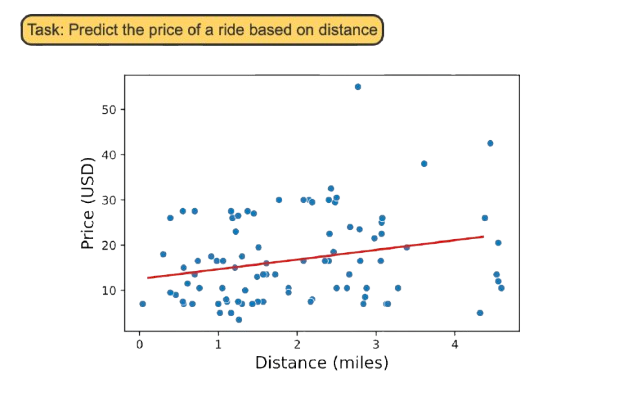

<!-- =========================================
     TITLE SLIDE (No Book Bind)
     ========================================= -->
<section>

  <!-- Main white paper w/ lines -->
  

    

    

        <h1>Pattern Recognition  and  Machine Learning</h1>
    

    

    <h4>Chapter 1: Introduction</h4>
    <ul>
      <li>Polynomial Curve Fitting</li>
      <li>Probability Theory</li>
      <li>Model Selection</li>
      <li>The Curse of Dimensionality</li>
      <li>Decision Theory</li>
      <li>Information Theory</li>
    </ul>
    

  

  <!-- “Hello My Name Is” sticker at top-right -->
  

    

      HELLO
       
      MY NAME IS
    

    

      Jue Guo
       
      University at Buffalo, SUNY
    

  

</section>

---

<!-- _class: spiral-slide -->

  <!-- The pink border around the white page -->
  

    

      

      

    

    

      <!-- Circle with the number -->
      

        01
      

    <h1 class="page-title">OVERVIEW</h1>
    
Introduction to Pattern Recognition

    

---

<section>
  

    

  
  ## History of Pattern Recognition

  - The problem of searching for patterns in data is a fundamental one and has a long and successful history.
  
  - For instance:
    - The extensive **astronomical observations** of **Tycho Brahe** in the 16th century allowed **Johannes Kepler** to discover the empirical laws of planetary motion, which in turn provided a springboard for the development of classical mechanics.
    - Similarly, the discovery of **regularities in atomic spectra** played a key role in the development and verification of quantum physics in the early 20th century.

  - The field of **pattern recognition** is concerned with:
    - The automatic discovery of regularities in data through the use of computer algorithms.
    - Using these regularities to take actions, such as classifying the data into different categories.

    
 <!-- /notepad-zone -->
  
 <!-- /body-container -->
</section>

---

<section>
  

    

  ## Recognizing Handwritten Digits

  

  <!-- Left Column -->
  

  - Consider the example of recognizing handwritten digits, illustrated in **Figure 1.1**.
    - Each digit corresponds to a **28 × 28 pixel image** and can be represented by a vector $\mathbf{x}$ comprising 784 real numbers.
    - The goal is to build a machine that:
      - Takes $\mathbf{x}$ as input.
      - Produces the identity of the digit ($0, \dots, 9$) as the output.

    

    <!-- Right Column -->
  

  - This is a **nontrivial problem** due to the wide variability in handwriting:
    - Handcrafted rules or heuristics for distinguishing the digits based on the shapes of the strokes often lead to a **proliferation of rules and exceptions**, resulting in **poor outcomes**.

    

    <!-- The push pin element (instead of tape) -->
    

    <!-- Your image and caption as usual -->
    
    

        Examples of handwritten digits taken from US zip codes.
    

    

  

  
 <!-- /.columns -->

 <!-- /notepad-zone -->

 <!-- /body-container -->
</section>

---

<section>
  

    

  ## Training and Generalization

  

  <!-- Left Column -->
  

- A **training set** is used to tune the parameters of an adaptive model.
  - Each digit in the training set is **individually inspected** and **hand-labeled**.
  - Categories of digits are represented by **target vectors** $\mathbf{t}$.

- The machine learning algorithm takes:
  - **Input vector $\mathbf{x}$** (new digit image).
  - Produces **output vector $\mathbf{y}$**, encoded in the same way as target vectors.

  <!-- Right Column -->
  

- **Key phases**:
  1. **Training phase**: $\mathbf{y(x)}$ is determined based on training data.
  2. **Generalization**: The model categorizes unseen examples correctly.

- **Practical challenges**:
  - Variability in handwriting makes training data only a small fraction of possible inputs.
  - Generalization is central to pattern recognition.

    

  
 <!-- /.columns -->

    
 <!-- /notepad-zone -->
  
 <!-- /body-container -->
</section>

---

<section>
  

    

  ## Pre-Processing and Dimensionality Reduction

  

  <!-- Left Column -->
  

  - **Pre-processing** transforms input variables to make the problem easier to solve:
    - For digit recognition, images are scaled and translated for consistency.
    - **Feature extraction** reduces variability across classes.

  - **Purpose**:
    - Reduces computational complexity.
    - Retains **useful discriminatory information**.

  

  <!-- Right Column -->
  

  - Example: Real-time face detection:
    - Features like **average image intensity over regions** (e.g., Viola and Jones, 2004).
    - Reduces dimensions while retaining essential information.

  - **Challenges**:
    - Over-simplification can harm model accuracy.
    - Important to preserve features critical to solving the problem.

  

 <!-- /.columns -->

  
 <!-- /notepad-zone -->

 <!-- /body-container -->
</section>

---

<section>
  

    

  ## Supervised and Unsupervised Learning

  - **Supervised Learning**:
    - Input vectors $\mathbf{x}$ with corresponding target vectors $\mathbf{t}$.
    - Example:
      - **Classification**: Assigning an input to one of a finite number of categories (e.g., digit recognition).
      - **Regression**: Predicting continuous variables (e.g., chemical yield prediction).

  - **Unsupervised Learning**:
    - Input vectors $\mathbf{x}$ without corresponding target values.
    - Examples:
      - **Clustering**: Discovering groups of similar examples in the data.
      - **Density Estimation**: Determining the distribution of data.
      - **Visualization**: Projecting high-dimensional data into 2D or 3D.

    
 <!-- /notepad-zone -->
  
 <!-- /body-container -->
</section>

---

<section>
  

    

  ## Reinforcement Learning

  - Focuses on finding suitable actions to maximize a reward through trial and error.
  - Characteristics:
    - The algorithm interacts with the environment over a sequence of states and actions.
    - Rewards depend on current and subsequent actions.

  - Example:
    - **Backgammon (Tesauro, 1994)**:
      - The system learns to make moves that maximize rewards over the game.
      - Challenges:
        - Credit assignment problem: Associating moves with their outcomes.
        - Trade-off between exploration (trying new actions) and exploitation (using known high-reward actions).

    
 <!-- /notepad-zone -->
  
 <!-- /body-container -->
</section>

---

<section>
  

    

  ## Tools and Techniques in Pattern Recognition

  - Each task requires specialized tools, but common ideas underlie all problems.
  - Goals of this chapter:
    - Introduce key concepts with simple examples.
    - Highlight foundational tools:
      - **Probability Theory**
      - **Decision Theory**
      - **Information Theory**

  - Later chapters:
    - Explore sophisticated models for real-world applications.

    
 <!-- /notepad-zone -->
  
 <!-- /body-container -->
</section>

---

<section>

## Summary

- **History**:  
  - From Kepler’s planetary motion to quantum physics, recognizing patterns drives progress.  
  - Algorithms now classify data into categories.  

- **Handwritten Digits**:  
  - Map 28×28 pixel images to digits.  
  - Challenge: Variability in handwriting.

<!-- Right Column -->

- **Learning Types**:  
  - **Supervised**: Classification, regression.  
  - **Unsupervised**: Clustering, density estimation, visualization.  
  - **Reinforcement**: Trial-and-error learning.

- **Key Concepts**:  
  - Pre-processing simplifies inputs.  
  - Core tools: **Probability**, **Decision**, and **Information Theory**.

 <!-- /.columns -->

 <!-- /notepad-zone -->

 <!-- /body-container -->
</section>

---

<!-- _class: spiral-slide -->

  <!-- The pink border around the white page -->
  

    

      

      

    

    

      <!-- Circle with the number -->
      

        02
      

    <h1 class="page-title">Example: Polynomial Curve Fitting</h1>
    <!-- 
You can enter a subtitle here if you need it
 -->
    

---

<section>

## Polynomial Curve Fitting - Overview

<!-- Left Column -->

- **Objective**:
  - Predict the value of $t$ (target variable) for a given $x$ (input variable).
  - Use a **training set** comprising $N = 10$ points.

- **Data Generation**:
  - Target values generated using $t = \sin(2\pi x)$ plus random Gaussian noise.
  - Goal: Discover underlying patterns in noisy data.

<!-- Right Column -->

    Training data (blue circles) and underlying function (green curve).

 <!-- /.columns -->

 <!-- /notepad-zone -->

 <!-- /body-container -->
</section>

---

<section>

## Key Challenges and Curve Fitting

<!-- Left Column -->

- **Challenges**:
  - Generalizing from a **finite training set** to new inputs.
  - Noise in observations introduces uncertainty.
  - Uncertainty in $t$ can arise due to:
      - Stochastic processes (e.g., radioactive decay).
      - Unobserved variability.

- **Approach**:
  - Fit the data using a polynomial function:
      $$
      y(x, \mathbf{w}) = \sum_{j=0}^M w_j x^j
      $$
  - $M$: Polynomial order, $w_j$: Coefficients.

<!-- Right Column -->

- **Curve Fitting Steps**:
  1. Use training set $(\mathbf{x}, \mathbf{t})$ to find coefficients $\mathbf{w}$
  2. Fit a curve that minimizes error for observed data.
  3. Balance between:
      - Capturing underlying patterns.
      - Avoiding overfitting.

- **Further Topics**:
  - Decision theory and probability theory for handling uncertainty.

 <!-- /.columns -->

 <!-- /notepad-zone -->

 <!-- /body-container -->
</section>

---

<section>

## Error Function for Polynomial Fitting

<!-- Left Column -->

- Coefficients $\mathbf{w}$ are determined by minimizing an **error function**:
    $$
    E(\mathbf{w}) = \frac{1}{2} \sum_{n=1}^N \big(y(x_n, \mathbf{w}) - t_n\big)^2
    $$
  - Measures the misfit between predictions $y(x_n, \mathbf{w})$ and target values $t_n$.
  - Factor $\frac{1}{2}$ included for convenience.

  - Goal: Minimize $E(\mathbf{w})$ to ensure predictions match training data.

<!-- Right Column -->

    Geometric interpretation of the error function.

 <!-- /.columns -->

 <!-- /notepad-zone -->

 <!-- /body-container -->
</section>

---
<section>

## Polynomial Order and Overfitting

<!-- Left Column -->

- The choice of polynomial order $M$ affects the model:
  - **Low-order polynomials** (e.g., $M = 0, 1$):
    - Poor representation of data.
  - **Moderate-order polynomial** ($M = 3$):
    - Captures the function $\sin(2\pi x)$ effectively.
  - **High-order polynomial** ($M = 9$):
    - Fits the training data exactly.
    - **Overfitting**: Poor generalization to unseen data.
  - **Model Selection**:
    - Balance between underfitting and overfitting.

<!-- Right Column -->

<!-- Ensure markdown="1" so `$M$` is parsed in this container -->

  

  
    

    Effects of polynomial order on curve fitting.
    

 <!-- end .cute-image-container -->

 <!-- end .column right-col -->

 <!-- end .columns -->

 <!-- end .notepad-zone -->

 <!-- end .body-container -->
</section>