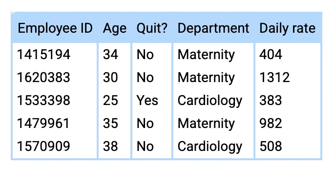
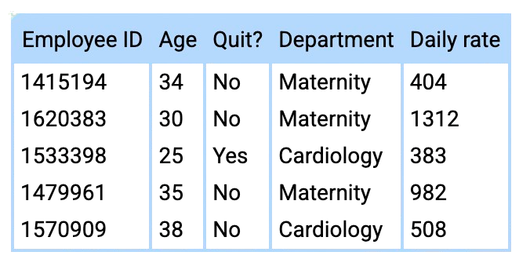
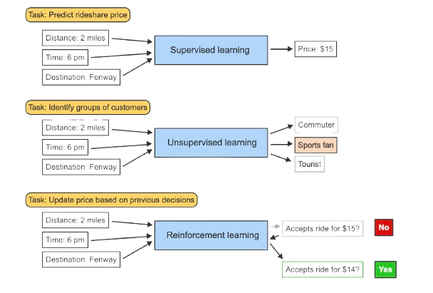

<!-- =========================================
     TITLE SLIDE (No Book Bind)
     ========================================= -->
<section>

  <!-- Main white paper w/ lines -->
  

    

    

        <h1>Pattern Recognition  and  Machine Learning</h1>
    

    

    <h4>Introduction to machine learning</h4>
    <ul>
      <li>Introduction to machine learning</li>
      <li>Feature and model types</li>
      <li>Bias-variance tradeoff</li>
      <li>Case study: Machine learning at Spotify</li>
    </ul>
    

  

  <!-- “Hello My Name Is” sticker at top-right -->
  

    

      HELLO
       
      MY NAME IS
    

    

      Jue Guo
       
      University at Buffalo, SUNY
    

  

</section>

---

<!-- _class: spiral-slide -->

  <!-- The pink border around the white page -->
  

    

      

      

    

    

      <!-- Circle with the number -->
      

        01
      

    <h1 class="page-title">Introduction to Machine learning</h1>
    

---

<section>

## Machine Learning

  <!-- Left Column -->
  

  **Machine learning** uses algorithms and models to make predictions and discover patterns in data.

  - A **model** is a mathematical function for describing the relationship between inputs and outputs and making predictions. 
  - An **algorithm** is a procedure or set of decision rules used to carry out a machine learning task, such as making a prediction.
  
  Machine learning combines tools and theory from computer science, artificial intelligence, statistics, and mathematics to make predictions and apply knowledge to new data.

  

<!-- Right Column -->
<!-- Right Column -->

  

    

    <!-- Replace with your actual path/filename -->
    
    

    
A rideshare fare can be predicted using machine learning by considering distance, location, traffic, time, and vehicle type. The model processes these inputs to produce a predicted price.

  

  

 <!-- end .column right-col -->

 <!-- end .columns -->

 <!-- end .notepad-zone -->

 <!-- end .body-container -->
</section>

---

<!-- _class: question-slide -->

## Machine Learning Questions

<ul class="question-bubble-list">
  <!-- MAIN QUESTION 1 (Bubble #1) -->
  <li>
    ____ uses algorithms and models to make predictions and discover patterns in data.
    <!-- Sub-list for choices (no bubble numbering here) -->
    <ul>
      <li>Artificial intelligence</li>
      <li>Data science</li>
      <li>Machine learning</li>
    </ul>
  </li>

  <!-- MAIN QUESTION 2 (Bubble #2) -->
  <li>
    A/an ____ makes predictions by following a set of decision rules.
    <!-- Sub-list for choices -->
    <ul>
      <li>algorithm</li>
      <li>formula</li>
      <li>model</li>
    </ul>
  </li>

  <!-- MAIN QUESTION 3 (Bubble #3) -->
  <li>
    Which discipline does <em>not</em> contribute tools and theory to machine learning?
    <!-- Sub-list for choices -->
    <ul>
      <li>Computer science</li>
      <li>Finance</li>
      <li>Statistics</li>
    </ul>
  </li>
</ul>

 <!-- end .notepad-zone -->

 <!-- end .body-container -->

---

<!-- _class: question-slide --> 
<!-- (Reusing 'question-slide' styling for consistency. 
     If you prefer a distinct .solution-slide, 
     just rename the class in your SCSS and here.) -->

## Solutions

<ul class="question-bubble-list">
  <li>
    ____ uses algorithms and models to make predictions and discover patterns in data:
    <ul>
      <li>Artificial intelligence</li>
      <li>Data science</li>
      <li class="correct-answer">
        Machine learning
        
          (It’s a subfield of AI that focuses on data-driven predictions.)
        
      </li>
    </ul>
  </li>
  <li>
    A/an ____ makes predictions by following a set of decision rules:
    <ul>
      <li class="correct-answer">
        algorithm
        
          (A procedure or set of rules for making predictions)
        
      </li>
      <li>formula</li>
      <li>model</li>
    </ul>
  </li>
  <li>
    Which discipline does <em>not</em> contribute tools and theory to machine learning?
    <ul>
      <li>Computer science</li>
      <li class="correct-answer">
        Finance
        
          (Used in finance but not developed there)
        
      </li>
      <li>Statistics</li>
    </ul>
  </li>
</ul>

---

<section>

## Dataframes

  <!-- Left Column -->
  

  A **dataset** is a collection of information containing features and instances.  
  - An **instance** is an individual data point or observational unit.  
  - A **feature** is a characteristic measured on each instance.  

  Datasets are often stored in **tabular** format, with instances as rows and features as columns.  
  A **tabular** dataset is commonly called a **dataframe**.

  

<!-- Right Column -->

  

    

    <!-- Replace with your actual path/filename -->
    
    

      

        A dataframe is a tabular structure where each row is an instance and each column is a feature. 
        This rideshare dataset includes distance, cab type, time stamp, destination, price, and surge multiplier, 
        with each row representing a single trip.
      

    

  

 <!-- end .column right-col -->

 <!-- end .columns -->

 <!-- end .notepad-zone -->

 <!-- end .body-container -->

</section>

---

<!-- _class: question-slide -->

## Nurse Dataframe Quiz

Hospitals are interested in increasing <strong>employee retention</strong>, especially for nurses.
The following <strong>dataframe</strong> contains each nurse’s ID, age, whether they recently quit,
their department, and their daily pay rate.

  <!-- Left Column: Image + Questions -->
  

  <ul class="question-bubble-list">
    <li>
      ____ are stored in tabular format.
      <ul>
        <li>Datasets</li>
        <li>Data points</li>
        <li>Dataframes</li>
      </ul>
    </li>
    <li>
      Which of the following is a feature in this nurse dataset?
      <ul>
        <li>Employee ID</li>
        <li>Age</li>
        <li>Department</li>
      </ul>
    </li>
    <li>
      Each row in the dataframe represents ____
      <ul>
        <li>hospitals</li>
        <li>nurses</li>
        <li>shifts</li>
      </ul>
    </li>
  </ul>

  
 <!-- end .column left-col -->

  <!-- Right Column: (Currently empty, add content if desired) -->
  

    

    

    <!-- Replace with your actual path/filename -->
    
  

  
 <!-- end .column right-col -->

 <!-- end .columns -->

---

<!-- _class: question-slide -->

## Nurse Dataframe Quiz: Solutions

  <!-- Left Column: Answers & Explanations -->
  

  <ul class="question-bubble-list">

  <!-- Question 1 -->
  <li>
    ____ are stored in tabular format.
    <ul>
      <li>Datasets</li>
      <li>Data points</li>
      <li class="correct-answer">
        Dataframes
        (Each row is a nurse instance, each column is a feature like ID or age.)
        
      </li>
    </ul>
  </li>

  <!-- Question 2 -->
  <li>
    Which of the following is a feature in this nurse dataset?
    <ul>
      <li>Employee ID</li>
      <li class="correct-answer">
        Age
        
          (Age is a characteristic column describing each nurse.)
        
      </li>
      <li>Department</li>
    </ul>
  </li>

  <!-- Question 3 -->
  <li>
    Each row in the dataframe represents ____
    <ul>
      <li>hospitals</li>
      <li class="correct-answer">
        nurses
        
          (Each row is one nurse, capturing their ID, age, department, etc.)
        
      </li>
      <li>shifts</li>
    </ul>
  </li>

  </ul>

  
 <!-- end .column left-col -->

  <!-- Right Column: Image (Optional) -->
  

  

    

    <!-- Replace with the same or different image if desired -->
    
    <!-- You can also omit the image or place an extra explanation here -->
  

  
 <!-- end .column right-col -->

 <!-- end .columns -->

 <!-- end .notepad-zone -->

 <!-- end .body-container -->

---
<!-- Slide: Input & Output Features -->
<section>

## Input and Output Features

  <!-- Left Column -->
  

Machine learning models use **input features** to predict the value of an **output feature**:

- **Input features** (explanatory variables) are the model’s inputs.
- **Output feature** (target variable) is the value the model aims to predict.

For example, in rideshare pricing:
- The distance of a trip is an **input feature**.
- The ride price is the **output feature**.

  

  <!-- Right Column: Image & Short Caption -->
  

  

    

    <!-- Replace with your actual path/filename -->
    
    

    
    A scatter plot showing **distance** (miles) on the x-axis and **price** (USD) on the y-axis.  
    Longer distances correlate with higher prices, suggesting a linear model might be suitable.
    

  

  
 <!-- end right-col -->

 <!-- end columns -->

 <!-- end .notepad-zone -->

 <!-- end .body-container -->
</section>

---

<!-- Slide: Input vs. Output Features -->
<!-- _class: question-slide -->

## Nurse Feature Types

  <!-- Left Column: Table Explanation + Image -->
  

Below is a sample dataframe with **Employee ID**, **Age**, 
**Quit?** status, **Department**, and **Daily rate**.  
Decide which features are **input** and which is **output**.

  

  <!-- Replace with your table image or an HTML table -->
  
  <!-- Optional caption if desired -->
  

    

      This table lists each nurse’s data, including daily pay rate and whether they quit. 
      You can identify <em>input</em> vs. <em>output</em> features by considering which 
      columns are independent variables and which is the target.
    

  

  
 <!-- end .column left-col -->

  <!-- Right Column: Bubble-Numbered Questions -->
  

  <ul class="question-bubble-list">
    <!-- Question 1 -->
    <li>
      Employee age is an ____ feature.
      <ul>
        <li>input</li>
        <li>output</li>
      </ul>
    </li>

  <!-- Question 2 -->
  <li>
    Daily rate is an ____ feature.
    <ul>
      <li>input</li>
      <li>output</li>
    </ul>
  </li>

  <!-- Question 3 -->
  <li>
    Whether an employee recently quit (Quit?) is an ____ feature.
    <ul>
      <li>input</li>
      <li>output</li>
    </ul>
  </li>
  </ul>

  
 <!-- end .column right-col -->

 <!-- end .columns -->

 <!-- end .notepad-zone -->

 <!-- end .body-container -->

---

<!-- Slide: Solutions & Explanations -->
<!-- _class: question-slide -->

## Nurse Feature Types: Solutions

<!-- Left Column -->

<ul class="question-bubble-list">

  <!-- Q1: Age is input -->
  <li>
    Employee age is an ____ feature.
    <ul>
      <li class="correct-answer">
        input
        (Age is an explanatory variable describing each nurse.)
      </li>
      <li>output</li>
    </ul>
  </li>

  <!-- Q2: Daily rate is input -->
  <li>
    Daily rate is an ____ feature.
    <ul>
      <li class="correct-answer">
        input
        (Pay rate is also an input/independent variable.
      </li>
      <li>output</li>
    </ul>
  </li>

  <!-- Q3: Quit? is output -->
  <li>
    Whether an employee recently quit (Quit?) is an ____ feature.
    <ul>
      <li>input</li>
      <li class="correct-answer">
        output
        (
          This is the target variable we're trying to predict: Did they quit or not?
        )
      </li>
    </ul>
  </li>

</ul>

 <!-- end .column left-col -->

<!-- Right Column (optional) -->

  

    

    
    

      Explanation of input vs. output in nurse data.
    

  

 <!-- end .column right-col -->

 <!-- end .columns -->

 <!-- end .notepad-zone -->

 <!-- end .body-container -->

---

<!-- Slide: 1.1.8 - Types of Machine Learning (Two-Column, Single Image) -->
<section>

<h1>Types of Machine Learning</h1>

<!-- Left Column: Text Content -->

  

    Three major areas of machine learning exist: 
    <strong>supervised learning</strong>, 
    <strong>unsupervised learning</strong>, 
    and <strong>reinforcement learning</strong>.
  

  <ul>
    <li><strong>Supervised learning</strong> predicts a known output feature based on input features.</li>
    <li><strong>Unsupervised learning</strong> describes patterns in a dataset without a known output feature.</li>
    <li><strong>Reinforcement learning</strong> describes algorithms that make decisions and update based on the result of the previous decision.</li>
  </ul>

 <!-- end .column left-col -->

<!-- Right Column: Single Image -->

  

    <!-- Replace with the correct path/filename -->
    
    

    

      

        The type of ML depends on the task: predicting price is supervised (output known), 
        grouping customers is unsupervised (no known output), and updating price after 
        rejection is reinforcement (feedback-based).
      

    

  

 <!-- end .column right-col -->

 <!-- end .columns -->

 <!-- end .notepad-zone -->

 <!-- end .body-container -->
</section>

---

<!-- _class: question-slide -->
<!-- Slide: Types of ML in Healthcare -->

<h2>Types of ML in Healthcare</h2>

<ul class="question-bubble-list">
  <!-- Bubble #1 -->
  <li>
    Prescribing a new chemotherapy drug dosage based on a patient's response to earlier treatment.
    <ul>
      <li>Supervised learning</li>
      <li>Unsupervised learning</li>
      <li>Reinforcement learning</li>
    </ul>
  </li>

  <!-- Bubble #2 -->
  <li>
    Predicting whether a nurse is likely to quit.
    <ul>
      <li>Supervised learning</li>
      <li>Unsupervised learning</li>
      <li>Reinforcement learning</li>
    </ul>
  </li>

  <!-- Bubble #3 -->
  <li>
    Identifying high-risk patients based on electronic healthcare records.
    <ul>
      <li>Supervised learning</li>
      <li>Unsupervised learning</li>
      <li>Reinforcement learning</li>
    </ul>
  </li>
</ul>

---
